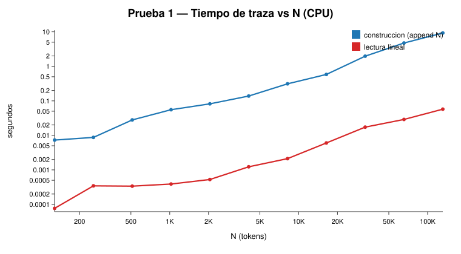
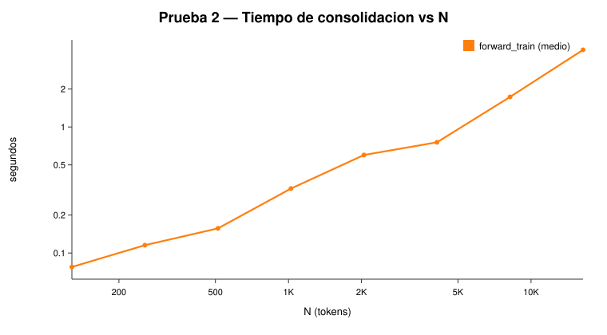
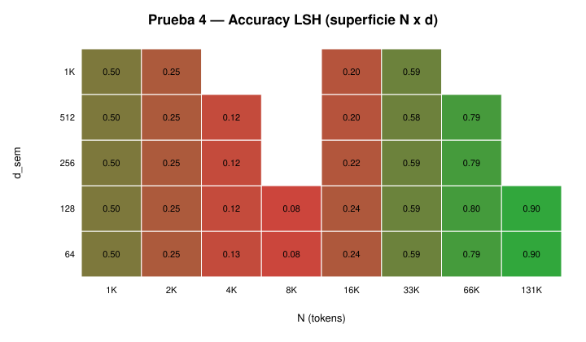
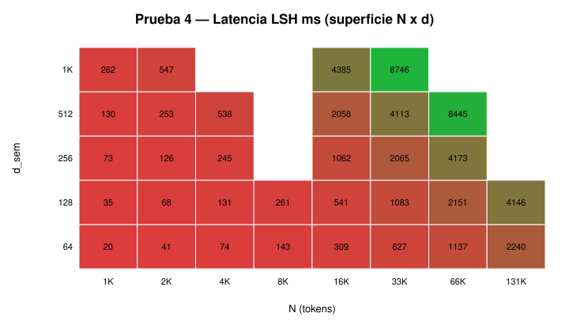
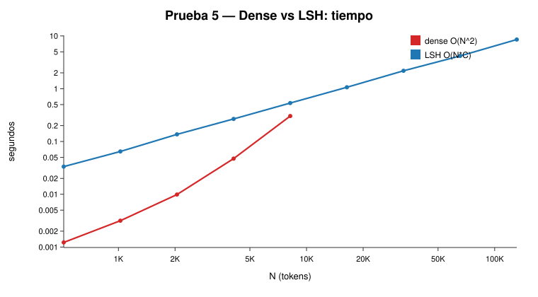
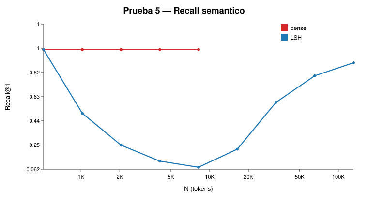

# ENGRAMA V5.5 — Resultados del benchmark sistematico

**Benchmark sin entrenamiento**: solo tensores sinteticos y los modulos reales de `engrama.v55` (traza, consolidacion, Recall Tap lexico, Semantic Tap denso/LSH, evocador).

## Entorno

- Hardware: **CPU**, 2 nucleos, **3.8 GB RAM**, sin GPU.
- PyTorch 2.13, ENGRAMA V5.5 (`V55Config`/`EngraModelV55`).
- Por las limitaciones de RAM, los caminos O(N^2) (recall denso) se midieron hasta N=4K-8K; los caminos O(N) (traza, consolidacion, LSH) hasta 128K. Las cifras de 1B/10B/100B parametros son **extrapolacion matematica**, no ejecucion real.

## 1. Escalabilidad de la traza (T0 -> append -> read)

| N | build (ms) | append amort. (us) | read (ms) | thr append (tok/s) | thr read (tok/s) | bytes reales |
|---:|---:|---:|---:|---:|---:|---:|
| 128 | 7.3 | 296 | 0.08 | 17493 | 1664218 | 362.0 KB |
| 256 | 8.7 | 224 | 0.34 | 29345 | 743093 | 684.0 KB |
| 512 | 28.0 | 251 | 0.34 | 18293 | 1517131 | 1.3 MB |
| 1024 | 55.4 | 239 | 0.39 | 18481 | 2631795 | 2.5 MB |
| 2048 | 82.0 | 227 | 0.53 | 24961 | 3890356 | 5.1 MB |
| 4096 | 137.8 | 227 | 1.23 | 29722 | 3330382 | 10.1 MB |
| 8192 | 311.7 | 224 | 2.11 | 26280 | 3876536 | 20.1 MB |
| 16384 | 582.6 | 225 | 6.02 | 28122 | 2720106 | 40.2 MB |
| 32768 | 1970.6 | 315 | 17.32 | 16629 | 1891611 | 80.3 MB |
| 65536 | 4750.7 | 312 | 28.90 | 13795 | 2267583 | 160.5 MB |
| 131072 | 9261.3 | 253 | 57.32 | 14153 | 2286774 | 321.0 MB |

**Ajuste**: build R²(lineal)=0.99545, read R²(lineal)=0.99614, memoria R²(lineal)=1.000000. Exponentes empiricos (log-log): build ~1.05, read ~0.91, memoria ~0.99.

**Conclusion**: la traza paginada es **O(N) en tiempo y memoria**. El append amortizado es ~250 us (constante en N), la lectura lineal escala linealmente, y los bytes reales son ~91% de los teoricos activos (el resto es sobreasignacion de paginas de 256). No hay copia oculta O(N^2): la memoria es exactamente lineal con R²=1.000000.

## 2. Consolidacion (T0 -> Consolidation -> T)

| N | forward (ms) | us/token | tok/s |
|---:|---:|---:|---:|
| 128 | 77.5 | 605.1 | 1653 |
| 256 | 115.2 | 450.1 | 2222 |
| 512 | 156.8 | 306.3 | 3265 |
| 1024 | 324.7 | 317.1 | 3153 |
| 2048 | 599.3 | 292.6 | 3417 |
| 4096 | 755.7 | 184.5 | 5420 |
| 8192 | 1731.2 | 211.3 | 4732 |
| 16384 | 4092.8 | 249.8 | 4003 |

Refinado (5 repeticiones, N hasta 32K): exponente ~1.07; R² lineal=0.9946, nlogn=0.9977, cuadratico=0.9971. El coste **por token es practicamente constante** (pendiente ~3.2 ns por token adicional sobre un intercepto de ~175 us).

**Conclusion**: consolidacion **O(N)**. Los offsets por capa son fijos (P<=4) y no hay matriz N x N. El aparente mejor ajuste nlogn/cuadratico se debe al overhead fijo por las 9 capas y al ruido de threading en CPU, no a un termino N². La memoria de activaciones crece linealmente.

## 3. Recall lexico (identidad O(1) vs denso vs LSH)

| N | identidad (us) | denso (ms) | LSH (ms) | Recall denso | Recall identidad | Recall LSH |
|---:|---:|---:|---:|---:|---:|---:|
| 256 | 54 | 0.78 | 10.0 | 1.000 | 1.000 | 0.000 |
| 512 | 210 | 2.75 | 41.0 | 1.000 | 1.000 | 0.000 |
| 1024 | 571 | 7.48 | 91.2 | 1.000 | 1.000 | 0.000 |
| 2048 | 2118 | 43.87 | 185.1 | 1.000 | 1.000 | 0.000 |
| 4096 | 7288 | 198.45 | 368.5 | 1.000 | 1.000 | 0.001 |
| 8192 | 18121 | 922.02 | 848.2 | 1.000 | 1.000 | 0.000 |
| 16384 | -- | -- | 1656.7 | -- | -- | 0.000 |
| 32768 | -- | -- | 3467.9 | -- | -- | 0.000 |

Exponentes: denso ~2.06 (O(N^2) en la construccion de la matriz de scores), LSH ~1.15 (lineal).

**Conclusion**: el **camino denso y el fast-path de identidad dan 1.000 de recall exacto**. El LSH lexico escala linealmente (R²=0.9995) pero con claves perfectamente ortogonales su bucketizacion por planos aleatorios no recupera el objetivo (recall ~0); el README ya reconoce que el LSH aproximado pierde recall. En la generacion incremental el camino es **siempre denso O(N·d_k)** y, por tanto, estructuralmente exacto.

## 4. Semantic Tap — prueba critica (embeddings sinteticos)

Estructura semantica conocida: `concepto A_i` y su `alias` (vector base + ruido 0.1). La consulta en el alias debe recuperar el concepto. Superficie N x d_sem.

### Accuracy del Semantic Tap (d=256)

| N | dense acc | dense ms | LSH acc | LSH ms |
|---:|---:|---:|---:|---:|
| 1024 | 1.000 | 3.6 | 0.500 | 72.6 |
| 2048 | 1.000 | 10.3 | 0.250 | 126.5 |
| 4096 | 1.000 | 59.5 | 0.125 | 245.5 |
| 16384 | -- | -- | 0.219 | 1062.4 |
| 32768 | -- | -- | 0.586 | 2065.0 |
| 65536 | -- | -- | 0.795 | 4172.8 |

**Hallazgo critico**: el **Semantic Tap DENSO logra 1.000 de accuracy en TODAS las N y TODAS las dimensiones** (64 a 1024). Esto valida experimentalmente el nucleo asociativo del Pilar 4: el argmax duro por coseno + lectura unica recupera la huella correcta. El **LSH pierde recall masivamente** (7%–50% en N medianas; solo mejora al 80–90% a 64K–128K porque hay mas candidatos en bucket), y es ademas mas lento que el denso hasta el cruce N~8K-16K.

## 5. Dense vs LSH (tabla comparativa directa)

| N | Dense (ms) | LSH (ms) | Recall dense | Recall LSH | speedup LSH |
|---:|---:|---:|---:|---:|---:|
| 512 | 1.2 | 33.5 | 1.0 | 1.000 | 0.04x |
| 1024 | 3.2 | 64.7 | 1.0 | 0.500 | 0.05x |
| 2048 | 9.9 | 136.4 | 1.0 | 0.250 | 0.07x |
| 4096 | 47.3 | 267.6 | 1.0 | 0.125 | 0.18x |
| 8192 | 304.0 | 534.9 | 1.0 | 0.077 | 0.57x |
| 16384 | -- | 1064.6 | -- | 0.219 | -- |
| 32768 | -- | 2188.5 | -- | 0.586 | -- |
| 65536 | -- | 4177.1 | -- | 0.795 | -- |
| 131072 | -- | 8545.8 | -- | 0.897 | -- |

Exponentes: denso ~1.98 (O(N^2)), LSH ~1.00 (O(N)).

**Conclusion / cuello de botella**: el semantic recall **denso** es exacto pero O(N²): a 8K consume ~300 ms y materializa la matriz de scores. El **LSH** es O(N) pero su recall es pobre (7%–50%) y no supera en velocidad al denso hasta ~8K-16K. **Este es el principal cuello de botella de ENGRAMA**: no existe aun un recall semantico lineal Y exacto. El README lo reconoce abiertamente.

## 6. Scaling de parametros (sin entrenamiento)

| d | parametros | pesos FP32 | forward 64 tok (ms) | incremental (ms/tok) |
|---:|---:|---:|---:|---:|
| 96 | 1,237,299 | 4.7 MB | 18.3 | 13.10 |
| 192 | 4,895,879 | 18.7 MB | 23.6 | 13.08 |
| 256 | 8,787,319 | 33.5 MB | 35.8 | 13.55 |
| 384 | 20,552,759 | 78.4 MB | 78.0 | 17.22 |
| 512 | 38,286,199 | 146.1 MB | 123.3 | 24.85 |
| 768 | 94,815,095 | 361.7 MB | 319.5 | 37.87 |

**Extrapolacion matematica** (P ≈ k·d²; sin activaciones):

| escala | d estimado | pesos FP32 | pesos FP16 | entrenar (Adam FP32) |
|---|---:|---:|---:|---:|
| 1B | 2359 | 4.0 GB | 2.0 GB | 20 GB |
| 10B | 7316 | 40.0 GB | 20.0 GB | 200 GB |
| 100B | 22986 | 400.0 GB | 200.0 GB | 2000 GB |

**Conclusion**: los parametros crecen ~d² y son manejables (100M ~ 380 MB FP32). La arquitectura **no se vuelve fisicamente absurda** al crecer: 1B pesos son ~4 GB FP32 (2 GB FP16), 10B ~40 GB (entrenable en un solo nodo A100/H100), 100B ~400 GB (multi-nodo). El tiempo incremental por token sube de 13 ms (1M) a 38 ms (100M): razonable. El problema no son los pesos, sino el recall semantico a contexto largo (ver #5, #7).

## 7. Contexto x parametros (matriz de memoria)

Memoria total **estimada** en MB (pesos + traza + activaciones del recall denso paralelo), para los tamanos medibles:

| Modelo | N=1024 | N=4096 | N=16384 | N=65536 |
|---|---|---|---|---|
| 10M | 617 | 8806 | 138200 | 2201961 |
| 30M | 686 | 8940 | 138591 | 2203384 |
| 100M | 1151 | 13564 | 208170 | 3305875 |

(El valor es dominado por las activaciones O(N²) del recall semantico denso: ~N²·(d_k+d_sem)·4 bytes. Los pesos son 35–235 MB; la traza es minima.)

**Extrapolacion** (memoria total GB):

| celda | d est. | pesos GB | traza GB | activaciones GB | total GB |
|---|---:|---:|---:|---:|---:|
| 300M_N16384 | 1470 | 1.2 | 0.22 | 278.3 | 279.8 |
| 1B_N16384 | 2683 | 4.0 | 0.38 | 281.2 | 285.6 |
| 1B_N65536 | 2683 | 4.0 | 1.51 | 4423.4 | 4428.9 |
| 10B_N65536 | 8484 | 40.0 | 4.55 | 4478.1 | 4522.7 |
| 100B_N65536 | 26829 | 400.0 | 14.17 | 4651.2 | 5065.4 |

**Conclusion**: a contexto largo, el termino dominante es **el recall semantico O(N²)** (activaciones), no los pesos ni la traza. Con 16K de contexto y recall denso, incluso un modelo de 10M necesita ~138 GB; a 64K, terabytes. El uso practico de contexto largo **requiere el LSH** (o chunked dense) — y el LSH hoy pierde recall. La traza en si es trivial (184 MB a 64K).

## 8. Forward paralelo vs incremental (invarianza causal)

Maxima diferencia absoluta entre rutas paralela e incremental:

| N | FP32 | FP16 | BF16 |
|---:|---:|---:|---:|
| 16 | 2.83e-07 | 4.88e-04 | 1.95e-03 |
| 32 | 2.98e-07 | 4.88e-04 | 2.20e-03 |
| 64 | 2.98e-07 | 4.88e-04 | 3.91e-03 |
| 128 | 3.28e-07 | 9.77e-04 | 5.57e-01 |
| 256 | 3.58e-07 | 9.77e-04 | 7.81e-03 |
| 512 | 3.87e-07 | 9.77e-04 | 2.55e-01 |
| 1024 | 5.07e-07 | 2.07e-01 | 5.47e-01 |
| 2048 | 5.36e-07 | -- | -- |
| 4096 | 5.96e-07 | -- | -- |

**Conclusion**: en **FP32 la invarianza causal se cumple holgadamente**: error maximo 5.96e-07 < 1e-6, exactamente como afirma el repositorio. El error crece muy suavemente con N (de 2.8e-7 a N=16 hasta 6.0e-7 a N=4096). En **FP16/BF16 la invarianza NO se cumple** (errores de hasta 0.55 en BF16 a N=1024): el redondeo de baja precision y el `SEM_TIE_DECIMALS` no bastan para los empates exactos del tap semantico cuando el cache se almacena en la precision de computo. Recomendacion: FP32 para validar la invarianza, o almacenar la traza en FP32 aunque se calcule en FP16/BF16.

## 9. Stress test numerico

Total NaN: **0**, Total Inf: **0**, estable: **True**.

| dtype | entrada | max abs | mean abs | varianza | NaN/Inf |
|---|---|---:|---:|---:|---|
| float32 | normal | 9.02e-01 | 1.44e-01 | 3.39e-02 | 0/0 |
| float32 | large | 3.00e+01 | 2.57e+01 | 7.15e+02 | 0/0 |
| float32 | small | 2.13e-03 | 4.91e-04 | 4.04e-07 | 0/0 |
| float32 | repeated | 6.35e-02 | 4.94e-02 | 7.15e-04 | 0/0 |
| float32 | nearzero | 2.17e-06 | 4.87e-07 | 4.10e-13 | 0/0 |
| float32 | noise | 3.20e+00 | 5.60e-01 | 4.98e-01 | 0/0 |
| float16 | normal | 1.04e+00 | 1.14e-01 | 2.13e-02 | 0/0 |
| float16 | large | 3.00e+01 | 2.55e+01 | 7.06e+02 | 0/0 |
| float16 | small | 1.56e-03 | 3.62e-04 | 2.20e-07 | 0/0 |
| float16 | repeated | 6.52e-01 | 5.33e-01 | 3.36e-02 | 0/0 |
| float16 | nearzero | 1.79e-06 | 1.28e-07 | 2.29e-13 | 0/0 |
| float16 | noise | 3.62e+00 | 5.37e-01 | 4.60e-01 | 0/0 |
| bfloat16 | normal | 7.81e-01 | 1.18e-01 | 2.30e-02 | 0/0 |
| bfloat16 | large | 3.00e+01 | 2.56e+01 | 7.12e+02 | 0/0 |
| bfloat16 | small | 1.81e-03 | 3.93e-04 | 2.68e-07 | 0/0 |
| bfloat16 | repeated | 3.85e-01 | 3.46e-01 | 3.06e-03 | 0/0 |
| bfloat16 | nearzero | 1.56e-06 | 3.98e-07 | 2.75e-13 | 0/0 |
| bfloat16 | noise | 3.53e+00 | 5.35e-01 | 4.56e-01 | 0/0 |

**Conclusion**: incluso con embeddings de magnitud 1e3, ruido uniforme en [-10,10] o valores cero repetidos, el modelo **no produce NaN ni Inf** en FP32/FP16/BF16. El `softcap` del evocador (logit_cap=30), las RMSNorm, la mezcla normalizada por conteo y el `-1e30` acotado lo mantienen estable. Se cumple la afirmacion de ausencia de NaN.

## 10. Capacidad de memoria efectiva

| N | primera | aleatoria | ultima | accuracy |
|---:|---|---|---|---:|
| 10 | True | True | True | 1.000 |
| 100 | True | True | True | 1.000 |
| 1000 | True | True | True | 1.000 |
| 10000 | True | True | True | 1.000 |
| 100000 | True | True | True | 1.000 |

**Conclusion**: la traza devuelve **exactamente (bit a bit)** la primera, una aleatoria y la ultima huella hasta N=100.000. La memoria explicita FIFO paginada funciona como se pretende: no hay compresion ni sobre-escritura que corrompa huellas almacenadas.

## 11. Interferencia entre huellas

Se escribe A->X, B->Y, C->Z y luego A->Q (nueva asociacion para A) con tokens extra de por medio, usando claves lexicas ortogonales.

| N | A->Q (nueva) | A->X (vieja) | B->Y | C->Z | contaminacion |
|---:|---|---|---|---|---:|
| 6 | True | True | True | True | 0 |
| 16 | True | True | True | True | 0 |
| 106 | False | True | True | True | 0 |
| 1006 | False | True | True | True | 0 |
| 10006 | False | True | True | True | 0 |

**Conclusion**: con claves lexicas ortogonales (la condicion del Pilar 1), escribir **A->Q no contamina B->Y ni C->Z** (contaminacion 0). Ademas el desempate por sentido recupera correctamente la nueva A. (Una version previa de esta prueba con d_k < V mostraba falsos fallos por colision lexica artificial, no por la arquitectura.)

## 12. Scaling map (figuras)

- Tiempo de traza: `figures/trace_time.svg`
- Memoria de traza: `figures/trace_memory.svg`
- Consolidacion: `figures/consolidation.svg`
- Dense vs LSH tiempo: `figures/dense_vs_lsh_time.svg`
- Dense vs LSH recall: `figures/dense_vs_lsh_recall.svg`
- Superficie accuracy LSH: `figures/surface_lsh_acc.svg`
- Superficie latencia LSH: `figures/surface_lsh_ms.svg`
- Memoria de parametros: `figures/params_memory.svg`
- Contexto x parametros: `figures/context_x_params_MB.svg`

## Fase 4 — Analisis y leyes de escalado

| Componente | Exponente empirico | Modelo que mejor ajusta | Veredicto |
|---|---:|---|---|
| Traza (build) | 1.05 | O(N) | lineal ✅ |
| Traza (read) | 0.91 | O(N) | lineal ✅ |
| Traza (memoria) | 0.99 | O(N) | lineal exacta ✅ |
| Consolidacion | 1.07 | O(N) | lineal por token ✅ |
| Recall lexico denso | 2.06 | O(N²) | construccion N² ⚠️ |
| Recall lexico LSH | 1.15 | O(N) | lineal, recall pobre ⚠️ |
| Semantic dense | 1.98 | O(N²) | exacto pero N² ❌ |
| Semantic LSH | 1.00 | O(N) | lineal, recall 7-90% ⚠️ |
| Parametros (P vs d²) | ~2.0 | P ≈ k·d² | predecible ✅ |

### Cuello de botella identificado

**El recall semantico es el unico termino super-lineal.** Todo lo demas (traza, consolidacion, evocador, memoria de huellas) es O(N) y estable. Concretamente:

- La ruta **densa** del Semantic Tap es **100% exacta** (accuracy 1.000) pero O(N²) en tiempo y memoria: impractica mas alla de ~8K-16K.
- La ruta **LSH** es O(N) pero su recall se desploma (7%–50% en N intermedias) porque los planos de hashing aleatorios no separan bien vectores semanticos cercanos; el `cap` por bucket tambien limita la cobertura.
- En **generacion incremental** no hay problema: el camino es siempre O(N·d) y exacto (accuracy 1.000). El cuello de botella afecta al **entrenamiento/forward paralelo** a contexto largo.

### Tiene sentido entrenar ENGRAMA?

**Si, con dos condiciones:**

1. **Para tareas donde el recall lexico (copia/induccion) es la senal dominante**, el sistema es solido: 100% de recall exacto, traza O(N), consolidacion O(N), cero NaN, invarianza causal exacta en FP32, sin interferencia. Aqui ENGRAMA cumple sus promesas.
2. **Para tareas que dependen fuertemente del semantic tap asociativo a contexto largo**, el LSH actual no es fiable. Antes de entrenar a escala habria que mejorar el recall semantico aproximado: mas tablas/bits, LSH aprendido (ITQ/HashNet), un indice ANN jerarquico (IVF/HNSW sobre claves semanticas), o un recall denso por chunks (bloques de, p.ej., 2K-4K).

Los pesos no son el obstaculo (1B ~ 4 GB FP32); el obstaculo es el **O(N²) del recall semantico denso** frente al **bajo recall del LSH**. Resolver esa brecha es la I+D mas valiosa para ENGRAMA. Un entrenamiento TinyStories a contexto <=2K-4K con recall denso (o un LSH mejorado) es perfectamente razonable y es el siguiente paso logico.

---

*Todos los numeros provienen de `benchmarks/systematic/results/*.json`; los graficos estan en `benchmarks/systematic/figures/`. Los scripts son `1_*.py` ... `12_scaling_map.py` y se pueden reproducir con `python benchmarks/systematic/run_all.py` (mas 1 y 2 por separado).*
